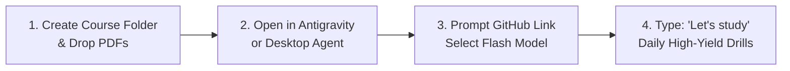

# 🎓 Universal AI Study Engine (`study-agent-skills`)

> **Turn any AI coding assistant into a world-class, exam-calibrated personal study tutor.**  
> Built for **Google Antigravity**, **Claude Desktop / Code**, **Cursor**, **Windsurf**, and any open Agent Skills-compatible harness.

[](LICENSE)
[](https://agentskills.io)
[]()

---

## ⚡ Instant 1-Prompt Setup (If you're already in your course folder)

If you have opened your university course folder in your AI desktop app (**Antigravity**, **Claude Desktop**, **Cursor**), simply paste this **one prompt** into the chat:

```text
Install the study skill set from https://github.com/leonkastner/study-agent-skills into this workspace and set up my study tutor for [Course Name].
```

That's it! The AI agent will clone the skills from GitHub, audit your slides, lock professorial terminology, and initialize your personal dashboard automatically.

---

## 🌟 Why the Universal Study Engine?

Studying for rigorous university exams (e.g. TUM, ETH, MIT, Stanford) with standard AI chat models often runs into two critical failure modes:

1. **Syllabus Blindspots (Past Exam Fixation):** AI tutors frequently over-index on old practice exams, skipping newly updated topics or exercises present only in this year's lecture slides.
2. **Terminology Drift (Paraphrasing Confusion):** LLMs naturally vary wording and use colloquial synonyms across sessions. In technical exams where rubrics allocate points for exact academic terminology (e.g. *Inherent Complexity*, *Evolutionary Nature*, *Demographic Parity*), changing wording breaks pattern recognition and destroys memorization.

**`study-agent-skills`** permanently eliminates these issues through:
- 📑 **Exhaustive Slide Auditing:** Spawns parallel subagents to index 100% of slide topics, equations, figures, and in-slide exercises into atomic units with zero omissions.
- 🔒 **Immutable Canonical Terminology Locking:** Extracts professorial definitions and required grading keywords directly from course slides, penalizing colloquialisms and maintaining 100% stable vocabulary across repetitions.
- 💬 **100% In-Chat High-Yield Active Tutoring:** Zero passive reading or external context switching. Rotates dynamically across 5 interactive formats (Scenarios, Math Calculations, Unguided Forensic Error-Spotting, Priority Triage, Taxonomy Matrices).
- 📊 **Dynamic Knowledge Ledger & Spaced Spiral Learning:** Atomic Bloom depth tracking (L1–L5), multi-session gradual mastery progression ($0\% \rightarrow 25\%/50\% \rightarrow 75\% \rightarrow 90\%/100\%$), 2-minute spiral warmups, and live markdown dashboard rendering.
- 🎯 **Authentic Mock Exam Simulator:** Generates timed, balanced exam papers covering 100% of the syllabus, scores with point-by-point rubrics, and schedules weak topics for immediate remediation.

---

## 🖥️ Recommended Apps & UI Setup (Skip the Terminal!)

> [!TIP]
> **Study UX Recommendation:** While command-line terminals (CLI) work, studying inside a raw terminal window can be visually tiring for reading tables, KaTeX formulas, and formatted feedback. We strongly recommend using a desktop agent app with a clean graphical chat interface:

1. 🥇 **Google Antigravity (App / Agent Manager):** *(Highly Recommended)*
   - Use the **Desktop App / Agent Manager** (not the raw CLI or the coding IDE lens).
   - Provides rich markdown rendering, LaTeX math formatting, clean sidebars for subagent execution, and seamless ledger updates.
2. 🥈 **Claude Desktop / Claude Code GUI / Coworker:**
   - Excellent typography, native markdown rendering, and clean conversational flow.
3. 🥉 **Cursor / Windsurf / ChatGPT Desktop / Codex:**
   - Great for students who already have an AI pair programmer installed.

---

## ⚡ Model Recommendation: Fast Models Win!

> [!IMPORTANT]
> **You do NOT need a heavy, slow, expensive frontier model!**
> 
> In interactive tutoring, **response speed is paramount**. Waiting 15–20 seconds between quiz questions breaks your cognitive flow and makes study sessions tedious.
> 
> * **Recommended Choice:** **Gemini Flash (e.g. Gemini 2.5 / 3.0 / 3.7 Flash)** or **Claude 3.5 Haiku / GPT-4o-mini**.
> * **Why Flash?** Flash models respond in under 1 second, have massive context windows to read all your slides, follow complex grading rubrics flawlessly, and keep rapid-fire drilling ultra-smooth and enjoyable.
> * In our benchmarks, **Antigravity paired with Gemini Flash was by far the fastest, smoothest study experience.**

---

## 🚀 5-Minute Step-by-Step Setup Guide



### Step 1: Create your Course Folder
Create a folder on your computer for your course (e.g. `Distributed_Systems/` or `Corporate_Finance/`):
```text
Distributed_Systems/
└── Course_Materials/
    ├── 01_Lecture_Slides/             <-- Drop your lecture PDF slides here (L01.pdf, L02.pdf...)
    ├── 02_Notes_and_Summaries/        <-- Drop your student notes, summaries, or reading scripts
    ├── 03_Past_Exams_and_Solutions/   <-- Drop past exams and solution keys (if available)
    └── 04_Syllabus_and_Admin/         <-- Drop syllabus, exam briefing slides, or audio transcripts
```

### Step 2: Open in your Desktop Agent App
Open your course folder in **Google Antigravity** (Desktop App), **Claude Desktop**, or **Cursor**.

### Step 3: Install the Skill & Initialize (1 Prompt)
Paste this into the chat:
```text
Install the study skill set from https://github.com/leonkastner/study-agent-skills into this workspace and set up my study tutor for [Course Name].
```

*(Alternatively, run `bash install.sh` or `python3 install.py` from the repository root).*

The agent will automatically:
1. Scan and audit 100% of your lecture slides in parallel subagents.
2. Lock professorial terminology into `Knowledge_Ledger/terminology_lock.json`.
3. Create your personal `Knowledge_Ledger/knowledge_ledger.json` and `Mastery_Dashboard.md`.
4. Output a **Document Gap Report** alerting you to any uncovered lecture topics.

### Step 4: Start Studying!
Whenever you sit down to study, simply type:
> **"Let's study"**

---

## 🏗️ Architecture & 3-Skill System

Instead of fragmented micro-skills, the system is organized into **3 high-cohesion, intent-aligned skills**:

```
                       ┌───────────────────────────────┐
                       │   UNIVERSAL STUDY SKILL SET   │
                       └──────────────┬────────────────┘
                                      │
         ┌────────────────────────────┼────────────────────────────┐
         ▼                            ▼                            ▼
┌───────────────────┐        ┌───────────────────┐        ┌───────────────────┐
│   course-setup    │        │   study-session   │        │     mock-exam     │
├───────────────────┤        ├───────────────────┤        ├───────────────────┤
│ • Multi-Subagent  │        │ • Spiral Warmup   │        │ • Authentic Paper │
│   Slide Audit     │        │ • 5 Active Formats│        │ • Timed Proctoring│
│ • Terminology Lock│        │ • Strict Rubrics  │        │ • Weakness Matrix │
│ • Gap Report      │        │ • Locked Keywords │        │ • Remediation Plan│
│ • Rule Scaffolding│        │ • Live Ledger Sync│        │ • Zero-Exam Synth │
└───────────────────┘        └───────────────────┘        └───────────────────┘
```

### 1. `course-setup` (The Intake Engine)
* **When to use:** First day of study, when setting up a new course workspace, or when new lecture materials are added.
* **What it does:**
  - Recursively scans all course materials (slides, transcripts, audio, notes, past exams).
  - Orchestrates parallel subagents across lecture batches to extract every slide section, formula, and in-slide exercise.
  - Builds `Knowledge_Ledger/knowledge_ledger.json` (30–60 atomic units with Bloom depth and exam priority).
  - Compiles `Knowledge_Ledger/terminology_lock.json` with exact professorial definitions and required grading keywords.
  - Generates a **Document Gap Report** asking for missing materials on any uncovered topics.
  - Auto-scaffolds lean `AGENTS.md` / `GEMINI.md` rules with zero manual editing required.

### 2. `study-session` (The Active Coach)
* **When to use:** Whenever you say *"Let's study"*, *"Quiz me"*, *"Drill Module 3"*, or *"Practice calculations"*.
* **What it does:**
  - Displays current readiness % and launches a **2-Minute Spiral Warmup** from decayed/fragile concepts.
  - Dynamically rotates across 5 active formats:
    1. **Applied Scenario Analysis & Architecture Diagnosis**
    2. **Numerical & Metric Calculations** (e.g., $P \times S$, Disparate Impact, Confusion Matrices)
    3. **Unguided Forensic Error-Spotting** (Strict zero-hint, zero-count protocol)
    4. **Real-Time Priority Triage & Decision Rules**
    5. **Taxonomy & Matrix Classification**
  - Grades with strict academic rubrics, penalizing colloquialisms and validating against `terminology_lock.json`.
  - Atomically updates `knowledge_ledger.json` and re-renders `Mastery_Dashboard.md` after every single turn.

### 3. `mock-exam` (The Proctor & Evaluator)
* **When to use:** Whenever you say *"Run a mock exam"*, *"Simulate 90-minute test"*, or *"Give me a practice paper"*.
* **What it does:**
  - Assembles authentic full-length exam papers covering 100% of the syllabus.
  - If no past exams exist, automatically synthesizes balanced exam questions from slide learning objectives and in-slide exercises.
  - Delivers questions in timed proctored blocks or as a standalone printable markdown/PDF exam sheet.
  - Evaluates answers point-by-point, generates a diagnostic post-mortem, and feeds weak topics directly into the study queue.

---

## 📁 Repository Structure

```text
study-agent-skills/
├── README.md                          # Main documentation & quickstart
├── LICENSE                            # MIT License
├── install.sh                         # 1-click bash installer
├── install.py                         # Cross-platform Python installer
│
├── AGENTS.md                          # Universal machine-readable guidelines
├── GEMINI.md                          # Antigravity / Gemini guidelines
├── CLAUDE.md                          # Claude Code slash commands & configuration
├── .cursorrules                       # Cursor legacy configuration
├── .cursor/rules/                     # Cursor modern .mdc rules
│   ├── course-setup.mdc
│   ├── study-session.mdc
│   └── mock-exam.mdc
│
├── skills/
│   ├── course-setup/                  # Ingestion, slide audit & terminology lock
│   │   ├── SKILL.md
│   │   ├── scripts/
│   │   │   ├── parse_slides.py        # PDF slide extractor
│   │   │   ├── parse_materials.py     # Transcripts/notes/scripts parser
│   │   │   └── init_ledger.py         # Knowledge ledger & terminology lock builder
│   │   ├── references/
│   │   │   ├── ledger_schema.json     # JSON Schema for knowledge ledger
│   │   │   ├── terminology_schema.json# JSON Schema for terminology lock
│   │   │   ├── subagent_intake_prompt.md # Parallel subagent prompt
│   │   │   └── gap_detection_guide.md # Gap analysis heuristic
│   │   └── resources/
│   │       └── dashboard_template.md  # Live dashboard template
│   │
│   ├── study-session/                 # 100% in-chat active study engine
│   │   ├── SKILL.md
│   │   ├── scripts/
│   │   │   └── update_ledger.py       # Atomic score updater & dashboard sync
│   │   ├── references/
│   │   │   ├── format_blueprints.md   # Blueprints for 5 question formats
│   │   │   ├── bloom_depth_matrix.md  # Bloom taxonomy calibration (L1-L5)
│   │   │   └── grading_rubrics.md     # Rubric deduction rules
│   │   └── resources/
│   │       └── warmup_templates.md    # Spiral warmup question templates
│   │
│   └── mock-exam/                     # Timed exam simulation & proctoring
│       ├── SKILL.md
│       ├── scripts/
│       │   └── generate_mock_exam.py  # Mock exam generator
│       └── references/
│           ├── exam_composition.md    # Point weighting & format distribution
│           └── diagnostic_report.md   # Weakness post-mortem guide
│
├── plugins/
│   └── study-agent-kit/               # Antigravity plugin bundle
│       ├── plugin.json
│       └── rules/
│           └── AGENTS.md
│
└── templates/
    ├── empty_course_workspace/        # Empty starter template for new courses
    └── examples/
        └── ERS_Case_Study/            # Fully worked reference case study
```

---

## 🤝 Contributing & License

Contributions are welcome! If you'd like to add new question formats, parser scripts for specific university platforms, or exam evaluation heuristics, please submit a Pull Request.

Distributed under the **MIT License**. See `LICENSE` for details.
