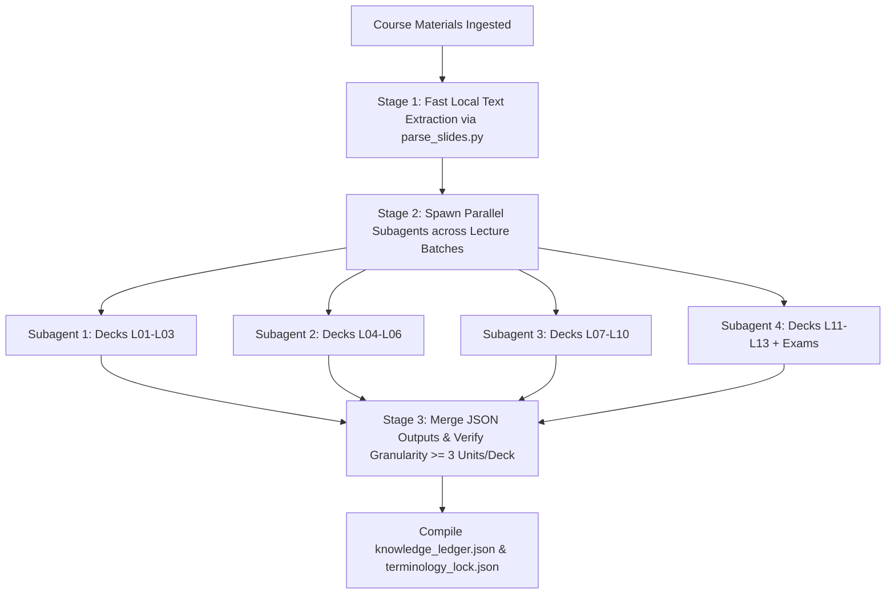

# Skill: `course-setup` (Course Ingestion, Slide Audit & Scaffolding)

Use this skill to onboard any new course or re-audit an existing course with updated materials.

---

## 1. Architectural Invariant: Mandatory Parallel Subagent Policy

> [!CAUTION]
> **Zero Single-Pass Aggregation Rule (Anti-Compression Invariant):**
> If a workspace contains **more than 3 lecture decks** or **more than 100 total slides**, the setup agent **MUST NOT** parse or synthesize the knowledge ledger in a single prompt turn.
> 
> **Why?** Single-pass ingestion causes severe **Aggregation Bias and Context Compression Loss**—subtle definitions, in-slide exercises, and edge-case mechanics get compressed into overly broad, shallow units (e.g. only 1–2 units per lecture instead of 4–6).

### The Two-Stage Ingestion Standard

1. **Stage 1 (Fast Parsing):** Run `python3 scripts/parse_slides.py` to extract text and identify exercise slides quickly into local JSON / text buffers.
2. **Stage 2 (Parallel Deep Semantic Audit):**
   - Group lecture decks into batches of **2 to 3 decks per subagent**.
   - Spawn parallel research subagents using the standardized template in [`subagent_intake_prompt.md`](./references/subagent_intake_prompt.md).
   - Each subagent performs deep semantic extraction on its assigned batch.
3. **Stage 3 (Synthesis & Verification):**
   - Merge the subagent JSON outputs into `Knowledge_Ledger/knowledge_ledger.json`.
   - Run the **Granularity Verification Rule**: Ensure every lecture produces **at least 3 to 6 atomic knowledge units**.

---

## 2. Step-by-Step Execution Runbook

### Step 1: Material Discovery & Classification
Scan the workspace and identify all available documents (slides, notes, past exams, formula sheets, transcripts).

### Step 2: Spawn Parallel Research Subagents
Dispatch subagents with explicit batch assignments:
- `Subagent A (Foundations L01-L03)`
- `Subagent B (Core Theory L04-L07)`
- `Subagent C (Advanced Topics L08-L11)`
- `Subagent D (Applications & Past Exams L12-L13)`

Each subagent must return:
- **Atomic Knowledge Units (3–6 per lecture):** Title, Bloom depth (`L1_Remember` to `L5_Develop`), exam priority, key examinable mechanisms, common misconceptions.
- **In-Slide Exercises & Formulas:** Exact slide numbers, problem parameters, and solution steps.
- **Canonical Terminology:** Specific academic terms, formal definitions, required grading keywords (0.5–1.0 pt items), and prohibited colloquialisms.

### Step 3: Compile Knowledge Ledger & Terminology Lock
1. Merge subagent outputs into `Knowledge_Ledger/knowledge_ledger.json` matching [`ledger_schema.json`](./references/ledger_schema.json).
2. Save locked technical terms into `Knowledge_Ledger/terminology_lock.json` matching [`terminology_schema.json`](./references/terminology_schema.json).
3. Set all initial mastery scores to `0%` (`Untested`).

### Step 4: Run Document Gap Analysis
Compare slide topics against available practice exercises and past exams:
- Follow [`gap_detection_guide.md`](./references/gap_detection_guide.md).
- Flag lectures that have slides but zero practice exercises so `mock-exam` can synthesize authentic questions.

### Step 5: Render Dashboard & Scaffold Rules
1. Render `Knowledge_Ledger/Mastery_Dashboard.md`.
2. Scaffold `AGENTS.md` and `GEMINI.md` in the project root with the course title, total points, and pointers to the knowledge ledger.

---

## 3. Granularity & Quality Checklist

Before completing `course-setup`, verify:
- [ ] **Total Knowledge Units:** $\ge 3 \times \text{Total Lecture Count}$ (e.g. 10 lectures $\ge 30$ units; 13 lectures $\ge 39$ units).
- [ ] **In-Slide Exercises:** All scenario/calculation slides captured with parameters.
- [ ] **Terminology Lock:** $\ge 3$ canonical terms locked per lecture module.
- [ ] **Exclusions:** Explicitly marked non-examinable topics tagged as excluded.
