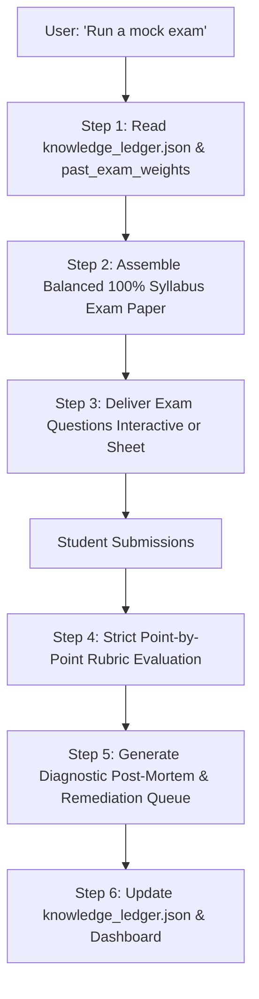

# 📝 Skill: `mock-exam` (Authentic Timed Mock Exam Simulator)

Use this skill whenever the user says *"Run a mock exam"*, *"Simulate 90-minute test"*, *"Give me an exam paper"*, or requests a formal diagnostic test.

---

## 1. Operating Protocol & Exam Simulation Modes

### Mode 1: In-Chat Proctored Exam (Interactive Block by Block)
- Delivers the exam question by question or module by module.
- Student answers each block; tutor grades strictly, provides instant rubric feedback, and immediately advances.

### Mode 2: Full Exam Sheet Generation (Self-Timed Mode)
- Generates a complete standalone Markdown / Typst exam paper (e.g. 10 Main Questions, 120 Total Points, 90 Minutes).
- Student solves on paper or text file, then submits full answers for comprehensive grading.

---

## 2. Step-by-Step Execution Runbook

### Step 1: Exam Composition & Syllabus Balancing
- Read `Knowledge_Ledger/knowledge_ledger.json`.
- Allocate points across all course modules proportionally (e.g. 10 questions $\times$ 12 points = 120 points total).
- **Format Balance:**
  - 25% Applied Scenario Analysis
  - 25% Taxonomy & Definition Recall
  - 20% Comparative Matrices & Tables
  - 15% Numerical & Metric Calculations
  - 15% Unguided Forensic Error-Spotting / True-False

### Step 2: Zero-Exam Fallback Generation
If the workspace has zero past exams:
- The engine synthesizes questions directly from slide learning objectives and in-slide exercises.
- Calibrates points using Bloom cognitive levels (L1 = 1–2 pts, L2 = 2–3 pts, L3/L4 = 3–6 pts).

### Step 3: Grading & Post-Mortem Diagnostic
- Grade strictly against professorial criteria and `Knowledge_Ledger/terminology_lock.json`.
- Generate the **Exam Diagnostic Report** using [diagnostic_report.md](./references/diagnostic_report.md).
- Identify fragile topics (< 60%) and automatically set their `review_urgency` to maximum (`3.0`) in `knowledge_ledger.json`.
