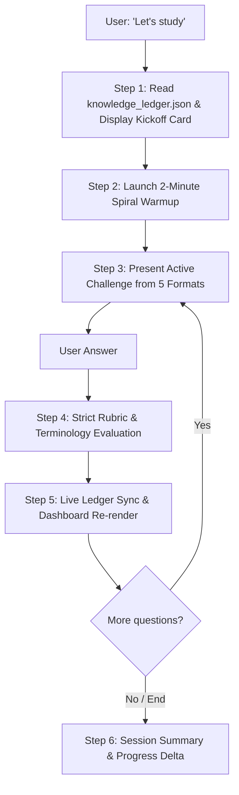

# 🧠 Skill: `study-session` (100% In-Chat Active Study Engine)

Use this skill whenever the user says *"Let's study"*, *"Start session"*, *"Quiz me"*, *"Practice Module X"*, or asks about a course topic.

---

## 1. Core Operating Principles

1. **100% In-Chat Active Learning:**
   - Zero passive lecturing. Always pose one focused, precise question at a time.
2. **2-Minute Spiral Warmup:**
   - Always open every session with 1–2 rapid-fire questions from previously tested or decayed units before introducing new material.
3. **Mandatory Format Diversity:**
   - Never ask two plain definition/recall questions in a row. Rotate across the 5 high-yield formats.
4. **Unguided Forensic Error-Spotting Protocol:**
   - When giving mock student response passages to evaluate: **Never give hints, never point to specific sentences, and never reveal the error count**. Force the student to analyze the entire passage cold.
5. **Strict Rubric Keyword Grading:**
   - Cross-check against `Knowledge_Ledger/terminology_lock.json`. Deduct points for colloquial approximations.
   - Output structured 4-part feedback:
     1. Numerical points awarded (e.g. `2.5 / 3.0 Points`).
     2. What was stated correctly.
     3. Colloquialisms vs. exact professorial terms.
     4. Missing mechanics and professorial model answer.
6. **Live Ledger Updates:**
   - Run `python3 scripts/update_ledger.py` or update `knowledge_ledger.json` and re-render `Mastery_Dashboard.md` immediately after every evaluated response.

---

## 2. Session Lifecycle Runbook



### Step 1: Session Kickoff & Interleaved Selection
1. Read `Knowledge_Ledger/knowledge_ledger.json`.
2. Select an interleaved mix of:
   - 1–2 new or fragile units (`mastery_score` < 60%).
   - 1 decayed unit with highest `review_urgency`.
3. Display the Kickoff Card:
   ```markdown
   ### 🎯 Study Session Kickoff
   * **Overall Exam Readiness:** XX.X% [████░░░░░░]
   * **Today's Interleaved Focus:** [Module A + Module B Connections]
   * **Spaced Review Targets:** [Fragile units to re-test with new angles]
   ```

### Step 2: 2-Minute Spiral Warmup
Immediately ask 1–2 rapid-fire questions from prior modules (definitions, True/False, or formula recall) using [warmup_templates.md](./resources/warmup_templates.md).

### Step 3: Interactive Challenge Rotation (5 Formats)
Rotate questions dynamically among:
- **Format 1: Applied Scenario Analysis & System Diagnosis** (e.g., given a system failure, diagnose which layer failed).
- **Format 2: Numerical & Metric Calculations** (e.g., step-by-step metric computations).
- **Format 3: Unguided Forensic Error-Spotting** (Mock student answer containing 1–3 subtle errors; student must find and correct them with zero hints).
- **Format 4: Real-Time Priority Triage & Decision Rules** (Ranking conflicting constraints).
- **Format 5: Taxonomy & Matrix Classification** (Placing mechanisms in 2D/3D grids or spectrums).

Consult [format_blueprints.md](./references/format_blueprints.md) for templates.

### Step 4: Strict Grading & Error Analysis
Grade the answer against [grading_rubrics.md](./references/grading_rubrics.md) and `Knowledge_Ledger/terminology_lock.json`.

### Step 5: Live Ledger Synchronization
Advance `mastery_score` gradually:
- First exposure / initial drill: `0% -> 25% (Fragile)` or `50% (Basic Recall)`.
- Second/Third exposure (interleaved / varied framing): `50% -> 75% (Solid Understanding)`.
- Delayed recall & cold mock exams: `75% -> 90%/100% (Exam Ready)`.

Update `knowledge_ledger.json` and re-render `Mastery_Dashboard.md`.

### Step 6: Session Wrap-Up
When the session concludes, report the demonstrated progress delta (+X.X%) and outline next session priorities.
